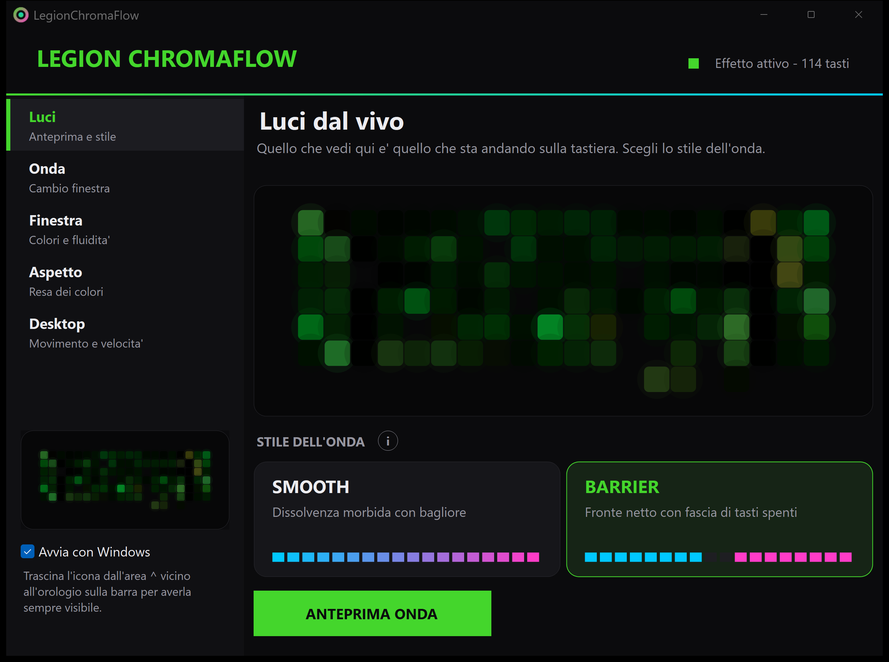
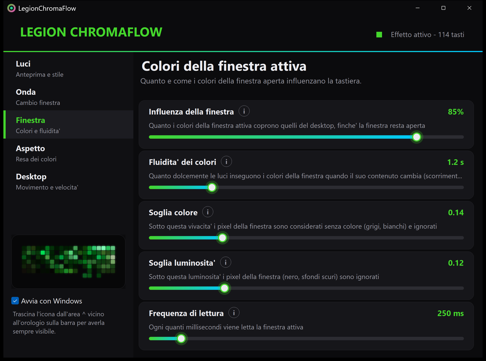

# LegionChromaFlow

**Le fond d'écran de votre bureau qui coule sur le clavier de votre Lenovo Legion.** 
Éclairage RVB dynamique touche par touche avec un panneau de contrôle façon Razer Chroma — sans Lenovo Vantage, sans cloud, sans dépendances.

[English](README.md) · [Italiano](README.it.md) · [Español](README.es.md) · **Français** · [Deutsch](README.de.md) · [Português](README.pt.md) · [简体中文](README.zh.md)

---

## Fonctionnalités

- 🖼️ **Éclairage piloté par le fond d'écran** — l'image du bureau défile et ondule lentement sur les touches, avec de petites ondulations lumineuses aléatoires.
- 🪟 **Teinte de la fenêtre active** — quand vous changez de fenêtre, ses couleurs se propagent **du centre du clavier vers les bords** et restent tant que cette fenêtre a le focus.
- 🎯 **Seules les vraies couleurs comptent** — les pixels noirs, gris et blancs sont ignorés. Une fenêtre noire laisse le clavier sur les couleurs du fond d'écran.
- ⚡ **Deux styles d'onde** — *Smooth*, un fondu doux avec lueur, ou *Barrier*, une fine bande de touches éteintes qui traverse le clavier avec les nouvelles couleurs juste derrière.
- 🧈 **Transitions fluides** — un temps de « suivi » réglable pour que les lumières glissent vers les couleurs de la fenêtre au lieu de procéder par à-coups.
- 🎛️ **Panneau façon Razer** — interface sombre, aperçu en direct du clavier, explication de chaque option ; les changements s'appliquent instantanément et sont enregistrés automatiquement.
- 🌍 **7 langues** — anglais, italien, espagnol, français, allemand, portugais et chinois simplifié, au choix dans le panneau.
- 🔔 **Icône dans la zone de notification** — clic gauche pour afficher/masquer le panneau, clic droit pour le menu rapide.
- 🔌 **Zéro dépendance** — utilise `hid.dll`, GDI+ et GDI. Seul .NET est nécessaire.
- 🤖 **Scènes IA optionnelles** — Claude peut concevoir une scène lumineuse (palette, motif, vitesse) pour la fenêtre que vous regardez, en plus des autres effets. Désactivées par défaut ; votre propre clé API est nécessaire.
- 🔒 **Hors ligne et privé par défaut** — rien ne quitte votre PC sauf si vous activez les scènes IA. Les pixels des fenêtres sont lus en mémoire et jamais enregistrés.

## Démarrage rapide

**Prérequis :** Windows 10/11 · [.NET 8 Desktop Runtime ou supérieur](https://dotnet.microsoft.com/download) (`winget install Microsoft.DotNet.DesktopRuntime.8`) · un portable Lenovo Legion avec clavier **Spectrum RVB par touche**.

1. **Téléchargez** le dernier zip depuis [Releases](../../releases) et extrayez-le (par exemple dans `C:\LegionChromaFlow`). Vous préférez le compiler ? Installez le SDK .NET 8 et lancez `build.bat`.
2. **Dans Lenovo Vantage**, choisissez un profil avec l'effet *Legion Aurora Sync*, cliquez sur **Appliquer**, puis **fermez complètement Vantage** (y compris dans la zone de notification). Vantage et ce programme ne doivent pas écrire sur le clavier en même temps.
3. **Vérifiez votre matériel**, dans cet ordre :

   | Étape | Commande | Ce qu'elle fait |
   |---|---|---|
   | 1 | `probe.bat` | Trouve le clavier, lit la carte des touches et le profil. **Ne modifie pas les lumières.** |
   | 2 | `test.bat` | Toutes les touches en rouge → vert → bleu quelques secondes, puis restaure votre profil. |
   | 3 | `OpenPanel.vbs` | Lance l'effet et ouvre le panneau de contrôle. |

4. Satisfait ? Cochez **Démarrer avec Windows** dans le panneau. `run-hidden.vbs` le lance discrètement dans la zone de notification ; `stop.bat` (ou *Quitter* dans le menu de l'icône) l'arrête et restaure votre profil d'éclairage.

> **Astuce :** Windows 11 masque les nouvelles icônes derrière la flèche `^`. Faites glisser l'icône LegionChromaFlow sur la barre des tâches pour qu'elle reste toujours visible.

## Panneau de contrôle

| Section | Ce que vous pouvez régler |
|---|---|
| **Lumières** | Aperçu en direct du clavier, cartes de style, bouton **Aperçu de l'onde** |
| **Onde** | Durée (secondes), épaisseur de la barrière, douceur du front, lueur |
| **Fenêtre** | Influence, **fluidité des couleurs**, seuils de couleur et de luminosité, fréquence de lecture |
| **Apparence** | Luminosité, saturation, gamma |
| **Bureau** | Vitesse du fond d'écran, scintillement, ondulations aléatoires, images par seconde |

Survolez l'icône ronde **ⓘ** à côté de chaque option pour voir ce qu'elle fait et ce que signifient les valeurs faibles et élevées. La langue se choisit en haut à droite. Tout est enregistré dans `config/config.json` (commentaires conservés) pendant que vous faites glisser les curseurs.

## Styles d'onde

| | **Smooth** | **Barrier** |
|---|---|---|
| Aspect | Les nouvelles couleurs se fondent depuis le centre avec une lueur douce | Une fine bande de touches éteintes s'étend ; les nouvelles couleurs apparaissent juste derrière |
| Impression | Fluide, ambiante | Nette, façon « scanner » |
| Options propres | Douceur du front, lueur | Épaisseur de la barrière |

## Dépannage

- **Clavier introuvable** — lancez `probe.bat` depuis une invite de commandes ouverte **en tant qu'administrateur** et lisez `logs\legionchromaflow.log`.
- **Scintillement ou couleurs qui ne changent pas** — Lenovo Vantage (ou un autre outil Legion) est encore actif. `probe` liste ceux qu'il détecte.
- **Clavier bloqué sur une couleur après un arrêt brutal** — changez de profil avec `Fn + Espace`, ou lancez l'application une fois et utilisez *Quitter*.
- **Pas assez fluide** — augmentez *Fluidité des couleurs* dans la section **Fenêtre**.
- **Après veille/reprise**, le programme se reconnecte tout seul.

Détails techniques, référence de la ligne de commande et tableau complet de configuration : voir le [README en anglais](README.md).

## Scènes IA (optionnelles)

Activez **IA** dans le panneau et Claude conçoit une scène lumineuse — palette, motif (`aurora`, `pulse`, `wave`, `sparkle`, `rain`, `fire`, `breathe`), vitesse et intensité — pour la fenêtre que vous regardez. La scène se superpose aux effets du fond d'écran et des couleurs de la fenêtre, et se fond quand vous changez de fenêtre.

- **Désactivées par défaut.** Votre propre clé API Anthropic est nécessaire : collez-la dans le panneau (enregistrée chiffrée pour votre utilisateur Windows avec DPAPI dans `config/ai.key`, exclu de git) ou définissez la variable d'environnement `ANTHROPIC_API_KEY`.
- **Ce qui est envoyé :** à chaque changement de fenêtre, une petite capture JPEG de cette fenêtre (768 px de large au maximum) part vers `api.anthropic.com`, au plus une fois par *Intervalle minimal* (12 s par défaut). Rien n'est envoyé lorsque la fonction est désactivée. Les fenêtres dont le titre contient des mots comme « password » ou « bank » sont ignorées (`AiSkipTitles` dans `config.json`).
- **Coût :** les requêtes sont facturées sur votre propre compte Anthropic. Le modèle par défaut est le petit et rapide `claude-haiku-4-5-20251001` ; changez-le avec `AiModel`.
- **Réglages :** *Intensité de l'IA*, *Intervalle minimal* et *Fondu de scène* dans la section **IA**.

## Compatibilité et avertissement

- Développé et testé sur le **Legion 7 16IRX9**. Les autres Legion avec le même clavier Spectrum *devraient* fonctionner mais ne sont pas testés : [ouvrez une issue](../../issues) avec la sortie de `probe`.
- Projet **non officiel**, sans lien avec Lenovo ou Razer ni approuvé par elles. Les marques appartiennent à leurs propriétaires.
- Il envoie au clavier les mêmes commandes que le logiciel de Lenovo. **Utilisation à vos risques** ; voir la [licence](LICENSE) pour l'exclusion de garantie.
- Non compatible avec Razer Chroma (aucun moyen officiel de s'y connecter sans identifiant d'application Razer).

## Sécurité et confiance

- Aucune télémétrie, aucune mise à jour automatique. La seule fonction réseau est celle, optionnelle et désactivée par défaut, des [scènes IA](#scènes-ia-optionnelles), qui ne parle qu'à `api.anthropic.com`.
- Les builds officiels sont produits uniquement par le [workflow de release](.github/workflows/release.yml) à partir d'un tag et fournis avec un `SHA256SUMS.txt`. Les binaires d'une autre provenance ne sont pas officiels — voir [SECURITY.md](SECURITY.md).
- Les forks sont les bienvenus sous GPL ; seul le mainteneur peut modifier ce dépôt.

## Crédits et licence

- Le protocole du clavier est dérivé de **Lenovo Legion Toolkit** du LenovoLegionToolkit-Team (GPL-3.0) ; ce projet utilise donc la même licence.
- Interface inspirée du style sombre et vert néon de Razer Synapse / Chroma Studio.
- Licence : [GPL-3.0](LICENSE). Si vous redistribuez le programme, vous devez conserver la même licence et rendre le code source disponible.
